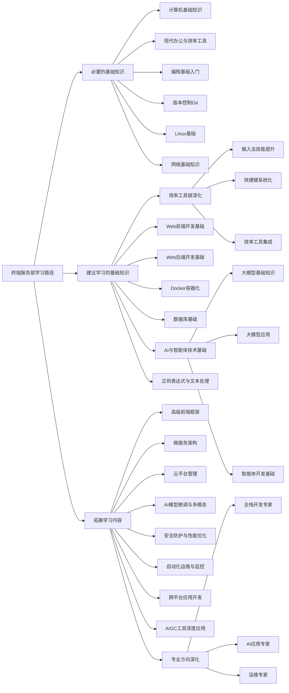

# 学习路径

> 自由、多元的树状学习路径——让每个成员都能以更高效的工作方式学习并完成任何任务。

## 一、课程定位

本页是终端服务部的**培训总路线**，回答两个问题：按什么顺序学、学到什么程度算会。

终端服务部是一个核心支撑部门，负责构建和维护可靠的技术基础，同时推动知识管理和智能化工具开发与应用。

本文档采用树状学习路径结构，分为三个层次：**必要的基础知识**、**建议学习的基础知识**、**拓展学习内容**，允许成员自由选择和快速查阅。

这一页把两件事合在一起讲，顺序不要颠倒：

1. 前面是**总则**——三级分类各自的判据，回答“这条内容该放进哪一级”。
2. 后面是**路径树**——每一级下面具体有哪些内容，回答“我现在该学什么”。

判据在前、清单在后，是因为清单会随技术趋势增删，判据相对稳定：先接受判据，再看清单，才知道为什么某条内容在第一级而不在第三级。

这条路线不是一门课，而是课程的目录——本部门「学习课程」下的每一门课，都能在这棵树上找到自己的位置。

---

## 二、面向对象

这条路径面向**终端服务部的全体新成员**，零基础可入；老成员按兴趣查表使用。

按起点分别看：

### 新手成员

1. 从**必要的基础知识**开始，打好基础
2. 掌握基本工作流程和工具使用
3. 参与部门基础工作，积累实践经验

### 进阶成员

1. 学习**建议学习的基础知识**，提升技能深度
2. 选择 1-2 个方向进行重点学习
3. 参与项目开发，应用所学知识

### 资深成员

1. 根据兴趣选择**拓展学习内容**
2. 在专业领域深入钻研
3. 带领项目，指导新人，推动技术创新

---

## 三、前置知识

无。这条路径从零基础可入——会开关机、会管理文件、会安装软件，就可以从第一级的第一项开始。

具体地：

- 不需要任何编程经验；「编程基础入门」本身就在这条路径的第一级里。
- 需要动手连服务器时，先补本部门的「设备接入与远程访问」一课（讲怎么把自己的设备接进组网、怎么远程登录）；这条路径里与它对应的是第一级的「网络基础知识」。
- 需要提交文档时，先读本部门的「文档写作」一课，以及站点上的写作规范页（写作规范在部门章之外，这里只以文字提及，不给链接）。
- 要动手写前端页面时，直接进本目录的「现代化 Web 开发」四周课程，不需要先学完第一级的所有内容。

自检方式：能说清“我的文件存在哪、用什么软件打开、怎么发给别人”，就算满足前置。

---

## 四、学习目标

学完并按要求走完这条路径之后，你应该能：

- 说清终端服务部的职责范围，知道要服务器、要账号、要发布内容分别该找谁；
- 拿到一条新技术时，能按三级判据判断它该放进必要、建议还是拓展；
- 独立完成第一级的最小任务集（计算机基础操作、Git 提交、Linux 常用命令、网络基本概念）；
- 选定 1-2 个建议方向，并说出选它的理由；
- 在拓展方向里产出一份可展示的成果。

### 三级路径的取舍原则

| 层级 | 定义 | 特点 | 目标 |
| --- | --- | --- | --- |
| 必要的基础知识 | 所有成员必须掌握的核心技能，是完成部门基础工作的前提 | 与部门核心职责直接相关，日常工作中频繁使用 | 确保团队成员具备基本的工作能力 |
| 建议学习 | 推荐学习的基础技能，能显著提升工作效率和质量 | 支持更复杂任务的完成，提升工作产出质量 | 帮助成员成长为合格的技术人员 |
| 拓展学习 | 根据个人兴趣和职业发展方向选择的专业深化内容 | 专业化、深度化的技能，支持个人职业发展和部门技术创新 | 培养专家级人才，推动部门技术创新 |

判断一条内容放哪一级，就看它落在上面哪一行的“定义”里。放不进去的，说明它还不够具体，先别往路径上挂。

### 评估与认证

#### 阶段性考核

- 每完成一个阶段进行自我评估
- 项目作品展示

#### 技能认证

- 内部技能等级评定
- 外部认证考试推荐

---

## 五、知识模块

### 树状学习路径结构

### 第一级：必要的基础知识

这一级的要求：所有成员必须掌握的核心技能，是完成部门基础工作的前提。判据是与部门核心职责直接相关、日常工作中频繁使用。

#### 1. 计算机基础知识

##### 计算机入门概念

- 计算机基础
- 操作系统简介（Windows/Linux/macOS）
- 文件管理基础

##### 网络基础知识

- 互联网是什么
- 浏览器使用
- 网站和网页基本概念
- 简单网络安全意识

##### 办公软件基础

- 文档编辑（Word/在线文档）
- 电子表格（Excel/在线表格）
- 演示文稿（PowerPoint）

#### 2. 现代办公与效率工具

##### 高效办公环境搭建

- 系统设置与个性化
- 常用软件安装与管理
- 快捷键使用

##### 效率工具链

- 文本编辑器（VS Code）
- 笔记软件（Notion/语雀）

#### 3. 编程基础入门

##### 编程思维培养

- 什么是编程
- 算法初步概念
- 逻辑思维训练

##### Python 基础语法

- 变量与数据类型
- 条件语句与循环
- 函数定义与使用
- 简单数据结构（列表、字典）

#### 4. 版本控制 Git

- Git 基础操作
- 分支管理
- 远程仓库使用

#### 5. Linux 基础

- 常用命令
- 文件权限管理
- 进程管理

### 第二级：建议学习

这一级的要求：推荐学习的基础技能，能显著提升工作效率和质量。特点是支持更复杂任务的完成、提升工作产出质量。

#### 1. Web 前端开发基础

##### HTML/CSS 基础

- 网页结构（HTML）
- 样式设计（CSS）
- 响应式布局概念

##### JavaScript 入门

- JS 基础语法
- DOM 操作
- 事件处理

##### 前端框架初探

- Vue.js 或 React 入门
- 组件化思想
- 简单前端项目

##### 完整的四周训练

这一格已经落地成一门课：本目录的「现代化 Web 开发」（第一周至第四周），从静态页面一路做到工具链优化与自主学习。

#### 2. Web 后端开发基础

##### 服务器与数据库基础

- 什么是服务器
- 数据库概念（MySQL/MongoDB）
- SQL 基础语法

##### 后端语言选择（Node.js/Python）

- RESTful API 概念
- 路由与中间件
- 数据库连接与操作

#### 3. Docker 容器化

- 容器概念
- Docker 基础使用
- 镜像与容器管理

#### 4. AI 与智能体技术基础

##### 大模型基础知识

- 什么是大语言模型
- AI 应用案例
- 提示词工程

##### 智能体开发基础

- 智能体概念与架构
- n8n 工作流编排基础
- MCP 协议与 A2A 通信概念

#### 5. 效率工具链深化

##### 输入法技能提升

- 全拼输入法基础与优化
- 双拼输入法精通（重点推荐）
- 五笔输入法专业应用
- 输入法配置与个性化
- 打字速度与准确率训练

##### 快捷键系统化

- 系统级快捷键（Windows/macOS/Linux）
- 开发工具快捷键（VS Code/IntelliJ）
- 办公软件快捷键（Office/在线文档）
- 自定义快捷键方案

##### 效率工具集成

- 快速启动工具（Quicker/Wox/Alfred）
- 剪贴板管理（Ditto/Paste）
- 窗口管理工具（PowerToys/Rectangle）

#### 6. 正则表达式与文本处理

##### 正则表达式基础

- 什么是正则表达式及其应用场景
- 基本语法：字符类、元字符、量词、分组
- 常用正则表达式模式示例

##### 编程语言中的正则表达式

- Python 中的 re 模块使用
- JavaScript 中的正则表达式方法
- 在文本编辑器中的搜索替换应用

##### 实际应用场景

- 数据验证（邮箱、电话、URL 等）
- 日志分析与文本提取
- 批量文件重命名与内容替换
- 命令行工具中的正则使用（grep、sed、awk）

### 第三级：拓展学习

这一级的要求：根据个人兴趣和职业发展方向选择的专业深化内容。特点是专业化、深度化，支持个人职业发展和部门技术创新。

#### 1. 专业方向深化

##### 全栈开发专家

- 微服务架构
- 性能优化
- 安全防护

##### AI 应用专家

- 模型微调
- 多模态应用
- 智能体编排

##### 运维专家

- 云平台管理
- 监控与告警
- 自动化运维

#### 2. 高级前端框架

- React/Vue 高级特性
- 状态管理（Redux/Vuex）
- 性能优化与调试
- 前端工程化

#### 3. 微服务架构

- 服务拆分与设计
- API 网关
- 服务发现与配置中心
- 分布式事务

#### 4. 云平台管理

- AWS/Azure/阿里云基础
- 云原生技术栈
- 容器编排（Kubernetes）
- 云安全与合规

#### 5. AI 模型微调与多模态应用

- 大模型微调技术
- 多模态模型应用
- 智能体高级编排
- AI 应用部署与优化

#### 6. 安全防护与性能优化

- Web 安全防护
- 系统安全加固
- 性能监控与调优
- 高可用架构设计

#### 7. 自动化运维与监控

- 自动化部署流水线
- 监控系统搭建（Prometheus/Grafana）
- 日志收集与分析
- 故障自愈系统

#### 8. 跨平台应用开发

- UniApp/Flutter/React Native
- iOS 原生开发（Swift）
- 安卓原生开发（Kotlin/Java）
- 桌面应用开发（Electron/Tauri）

#### 9. AIGC 工具深度应用

- Stable Diffusion/ComfyUI 高级应用
- AI 视频生成与编辑
- 3D 模型生成
- AI 辅助设计工作流

### 快速查阅指南

#### 按职责快速查找

- **基础设施运维**：Linux 基础、Docker 容器化、自动化运维
- **知识管理与创新**：编程基础、正则表达式与文本处理、AI 与智能体技术、AIGC 工具
- **平台运营与内容创作**：Web 前端开发、跨平台应用开发

#### 按兴趣快速查找

- **前端开发**：Web 前端开发基础 → 高级前端框架 → 跨平台应用开发
- **后端开发**：Web 后端开发基础 → 微服务架构 → 云平台管理
- **AI 与智能体**：AI 与智能体技术基础 → AI 模型微调 → 智能体编排
- **运维与 DevOps**：Linux 基础 → Docker 容器化 → 自动化运维

### 路径的更新机制

本学习路径将根据技术发展和部门需求定期更新：

1. 每季度评估一次分类合理性
2. 根据新技术趋势添加新内容
3. 根据成员反馈调整学习重点

---

## 六、实践内容

路径上的每一级都配一组可动手的任务，做完才算这一级过了。任务之间没有强依赖，按自己缺的部分挑着做。

### 第一级（必要）的动手任务

- 装好常用软件与文本编辑器，配一套顺手的快捷键（对应「现代办公与效率工具」）。
- 用 Git 建一个仓库，完成一次“建分支 → 提交 → 合并到主干 → 推到远程仓库”的完整流程（对应「版本控制 Git」）。
- 在一台 Linux 服务器上完成：登录、看目录、改权限、查进程、找出占用磁盘的文件（对应「Linux 基础」）。
- 说清 IP、端口、域名、代理分别是什么、在浏览器里各自出现在哪（对应「网络基础知识」）。

每一项的验收标准：能把过程写成一页文档，别人照着做能复现。

### 第二级（建议）的动手任务

- **Web 前端**：用一个静态页面加一个交互功能跑通 HTML/CSS/JS 三件套；完整的四周训练见本目录的「现代化 Web 开发」课程（第一周至第四周）。
- **Web 后端**：用 Node.js 或 Python 起一个最小服务，提供一个 RESTful 接口并连上数据库。
- **Docker**：把一个现成服务容器化，能起来、能看日志、能挂载数据卷。
- **AI 与智能体**：用提示词工程做一个可复用的小工具；串一条 n8n 自动化工作流；能讲清 MCP 协议与 A2A 通信的基本概念。
- **效率工具链**：把输入法、快捷键、快速启动、剪贴板管理配成一套开机即用的环境。
- **正则表达式**：用正则解决一次真实的数据清洗或日志提取问题。

验收标准：产出物能被别人检查（仓库地址、截图或一份运行记录）。

### 第三级（拓展）的动手任务

- 在「全栈开发专家 / AI 应用专家 / 运维专家」里选一个方向，产出一份可展示的成果（部署上线的服务、模型评测报告或一套运行手册）。
- 把这一级学到的新技术写成部门知识库的一页，提一个能通过 CI 的 PR。

验收标准：成果能被别人复现；文档能让没学过的人独立看懂。

### 学习方法建议

#### 1. 理论与实践结合

- 每学一个知识点都要动手实践
- 通过项目整合所学内容

#### 2. 循序渐进

- 从必要基础开始，逐步深入
- 扎实掌握基础后再进入下一阶段

#### 3. 团队协作

- 参与开源项目
- 代码审查与分享
- 技术交流会议

#### 4. 个性化学习路径

- 根据个人兴趣选择拓展方向
- 结合部门需求调整学习重点
- 定期评估学习进度和效果

---

## 七、项目衔接

路径的末端指向本部门的真实项目实践，而不是一组练习题。

- **下一步的课**：走完第二级里的「Web 前端开发基础」一格，就是本目录的「现代化 Web 开发」课程，从第一周到第四周按顺序上；四周上完再回到本页挑第三级的方向。
- **接项目**：学完第一级再加一个建议方向之后，接本部门项目实践里的一个真实项目（例如“设备与 Agent 统一管理”），按它的复现步骤独立跑通一次——这是新人上手的第 ⑤ 步。
- **接文档**：把做过的事写成一篇能通过 CI 的文档，提进本部门知识库——这是第 ⑥ 步，也是真正入门的标志。
- **还没人做的方向**：路径里列了但部门还没有专门课程的内容（例如「算力与 GPU 基础」「虚拟化与容器」的进阶部分），谁先学会谁负责把它写成课。
