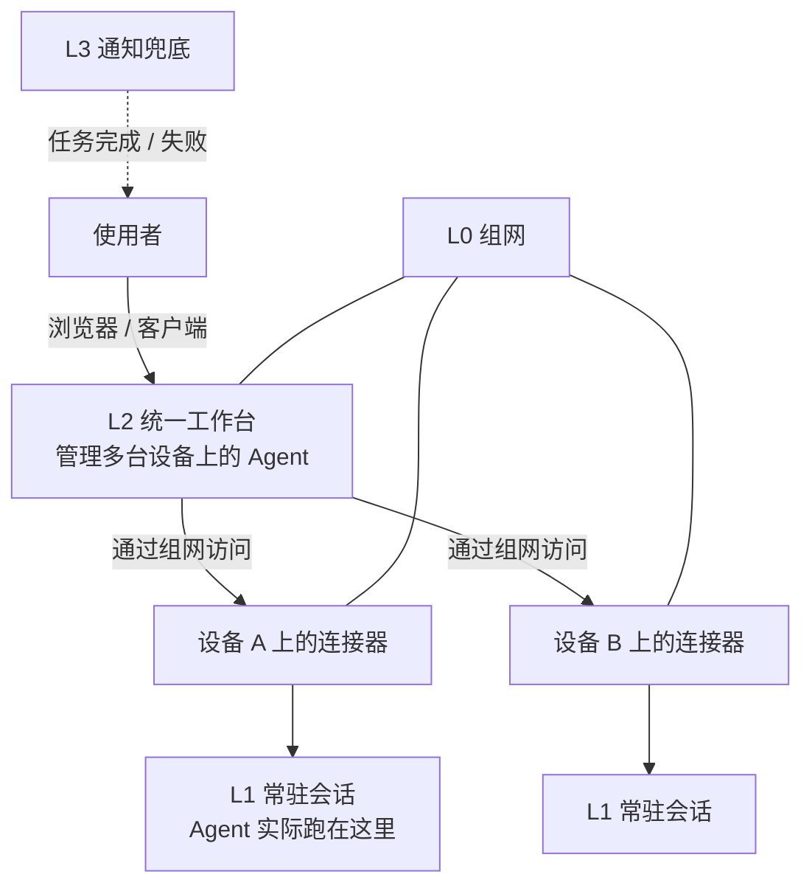

# Agent 平台部署

## 一、技术是什么

"Agent 平台"不是一个具体软件，而是**让 Agent 从"我在自己电脑上跑一个"变成"部门里多人多机都能稳定用"的那一层基础设施**。

它由四层组成，每层解决一个独立的问题，**可以分开选、分开换**：

| 层 | 解决什么 | 本实验室的选择 |
| --- | --- | --- |
| **L0 组网** | 不同网络里的设备怎么互相连 | [Tailscale](Tailscale组网.md) |
| **L1 会话常驻** | 断线之后长任务怎么不死 | 终端复用器（会话常驻工具） |
| **L2 统一工作台** | 怎么在一个界面里管所有设备上的 Agent | 自托管的多设备 Agent 控制台 |
| **L3 通知兜底** | 任务完成/失败怎么让人知道 | 推送服务 + 现有 IM 机器人 |

**分层的意义在于换掉一层不用动其它层。**当时把"组网"和"Agent 管理"分开选，就是因为这两件事的成熟周期和风险完全不同——组网选错了是网络不通，Agent 平台选错了只是换个界面。

---

## 二、为什么使用

在本机直接跑 Agent 会遇到五个问题，这五个问题就是这一层存在的理由：

| 问题 | 具体表现 | 对应层 |
| --- | --- | --- |
| **断线即死** | 关掉终端/网络闪断，跑了几小时的任务没了 | L1 |
| **换机器接不上** | 在笔记本上起的任务，回宿舍想接着看，看不见 | L1 + L2 |
| **多人各搞一套** | 每个人自己装、自己配，出问题只能自己查 | L2 |
| **不知道任务完了没** | 得一直盯着，或者过很久才想起来看 | L3 |
| **设备变多管不过来** | 五台机器五个入口，配置散在各处 | L2 + 一份清单 |

还有一个不常被说出来但很重要的理由：**"能跑"和"能被别人接手"是两件事**。个人机器上那套跑得再顺，人一离开就归零。把平台这一层固化下来，是为了让经验不依赖于"记得住的那个人"。

---

## 三、工作原理

### 3.1 四层怎么协作



关键点：**Agent 不跑在工作台里，跑在被管理设备上的常驻会话里。**工作台只是"遥控器"。这样工作台重启不会杀掉任务，某台设备掉线也只影响那一台。

### 3.2 连接器模式

被管理的每台设备上装一个**连接器（connector）**，它主动向控制面注册自己，然后控制面就能把指令发给它。这个方向很重要：

- 连接器**主动外连**，所以设备不需要暴露任何端口到公网。
- 每台设备有**唯一标识**（connector id），控制面靠它认设备。
- 连接器崩溃或掉线 → 设备显示离线，**任务本身还在常驻会话里跑**，重连之后能接上。

### 3.3 会话常驻是怎么做到的

用一个**终端复用器**把 Agent 跑在一个"分离后仍然存活"的会话里：

```text
启动 Agent → 跑在复用器的会话里
    ↓
使用者"分离"（detach）→ 会话继续跑，使用者可以关掉终端
    ↓
换个地方"接入"（attach）→ 看到一模一样的现场
```

约定：**所有 Agent 都跑在常驻会话里，不直接跑在裸终端上。**这条约定比任何工具选择都重要——它把"任务会不会因为断线而失败"这个问题一次消灭。

---

## 四、使用环境

| 层 | 需要什么 |
| --- | --- |
| L0 | 设备能出网；见 [Tailscale 组网](Tailscale组网.md) |
| L1 | 每台被管理的设备装终端复用器（Linux / macOS / WSL 原生支持，Windows 走 WSL） |
| L2 | 至少一台**常开的机器**跑控制面；Docker 环境；一个可被组网访问的端口 |
| L3 | 一个推送服务；一个 IM 机器人（**只保留一个**，多个会互相打架） |

**部署形态建议**：控制面用容器跑（干净、好迁移、好回滚），数据卷单独挂出来（这样容器重建不丢配置）。

**不要**把控制面直接绑到公网。**只绑组网地址或 `127.0.0.1` + 组网代理**，需要外部访问时再单独设计鉴权（见第七节的一个真实教训）。

---

## 五、基本使用

### 5.1 会话常驻的日常操作

```bash
# 起一个带名字的常驻会话（命名规范见 5.3）
<复用器> new -s agent-<设备>-<名字>

# 在里面启动 Agent，然后"分离"离开 —— 会话继续跑
#   （具体按键依工具而定，通常是 detach 快捷键）

# 回到本机之前那个会话
<复用器> attach -t agent-<设备>-<名字>

# 从另一台机器接管某设备上的会话
<复用器> --remote <host>
<复用器> --remote ssh://<用户>@<主机>:22

# 列出本机所有会话
<复用器> list
```

**分离 ≠ 结束。**只有显式停止（停掉复用器的服务端）才会真正杀掉会话。忘了这一点就会误以为"关掉窗口任务就没了"。

### 5.2 新增一台设备到平台上

```text
① 确认设备已加入组网，且能从控制面所在的机器访问到
② 在设备上装常驻会话工具
③ 在设备上装连接器，指向控制面地址，注册并拿到 connector id
④ 在控制面里确认设备上线
⑤ 把这台设备加进设备清单（主机名、角色、负责人）
⑥ 通知部门：新设备可用了
```

第 ⑤ 步**不是可选的**。没有清单，半年后没人知道这台机器是谁的、还在不在用。清单结构见[项目实践：设备与 Agent 统一管理](../项目实践/设备与Agent统一管理.md)。

### 5.3 命名规范

**统一用 `<角色>-<位置或编号>`，不要用随机主机名。**

```text
会话名：  agent-<设备名>-<用途>       例：agent-laptop-build
设备名：  <角色>-<编号>               例：gpu-01、server-a、edge-03
```

理由很实际：组网里的设备名会出现在**每一个**界面、日志和告警里。命名混乱的代价不是"不好看"，而是每次排查都要先花两分钟想"这台是哪台"。

---

## 六、实际应用

### 6.1 本实验室的落法

- **L0**：Tailscale 组网，控制面与各设备都在 tailnet 内（见 [Tailscale 组网](Tailscale组网.md)）。
- **L1**：所有 Agent 跑在终端复用器的会话里，会话名按 5.3 的规范。
- **L2**：在一台常开服务器上用容器跑自托管控制台；各设备装连接器注册进去。
- **L3**：任务通知走一个推送服务 + **一个** IM 机器人。

### 6.2 一个真实的选型结论

L2 这一层我们比较过几个方案，最后的判断依据不是功能多少，而是**"它能不能覆盖我们已经在用的那些运行时"**。有几款工具做得很好但只覆盖特定几个 Agent 运行时，那样反而会让我们被迫改变现有的使用方式——**工具应该适应已有的工作方式，而不是反过来。**

所以选型时列了一张"必须在覆盖范围内的运行时"清单，逐个核对。这个做法建议保留：**下次换工具时，先写清单再比较产品**，否则很容易被演示效果带走。

### 6.3 从零到可用的顺序

```text
先 L0（没网络什么都谈不上）
  → 再 L1（把"断线即死"这个最痛的问题解决掉，投入最小、收益最大）
    → 再 L2（设备多到管不过来时才有必要）
      → 最后 L3（通知是锦上添花，但长任务场景下它是刚需）
```

**不要一上来就上 L2。**一个人一台设备的时候，L2 带来的复杂度大于收益。

---

## 七、常见问题

### 7.1 连接器注册不上

| 现象 | 原因 | 处理 |
| --- | --- | --- |
| 报"记录正忙"（record is busy）类错误 | 上一次注册没有干净退出，**锁没释放** | 找到残留进程停掉，再重试；不要反复点重试（锁是按路径算的，重试永远不会成功） |
| 设备一直显示离线 | 连接器没起来 / 被防火墙拦 / 控制面地址不对 | 在设备上看连接器日志，先确认能访问到控制面 |
| 注册成功但一重启就没了 | 连接器没做成开机自启 | 做成系统服务或计划任务 |

### 7.2 迁移旧版留下的锁（一个非常难查的坑）

从旧版连接器迁移到新版时，旧版会在用户目录下留一个**目录名与新版不同**的记录文件（典型差异是一个连字符）。如果这个旧记录还在：

- 新版会尝试迁移它；
- 迁移过程里占用的锁**由这个文件的绝对路径哈希决定**；
- 于是无论重试多少次，都会命中同一把锁 → **永久卡住**，报"正忙"。

**处理办法**：不要反复重试，而是在新版期望的位置**预先写一个"迁移已完成"的标记文件**，把这个迁移步骤跳过。处理完之后，那个旧目录里的记录文件可以归档留证，不要直接删——万一以后要追溯注册历史。

**这个坑的通用教训**：任何"第一次启动时自动迁移旧数据"的逻辑，都必须是**幂等且可跳过**的。判断一个自建服务是否设计得好，就看它第一次启动失败之后能不能手动接管。

### 7.3 把控制台暴露到非本机地址时的两个要求

自托管的控制台默认只允许本机访问。一旦绑到非本机地址，它会**强制要求登录**，并且需要你**显式声明对外的公开地址**。不做这两件事，访问会直接被拒（典型表现是 `Invalid Host header`）。

正确做法：

1. 配置访问控制（用户名 + 密码，或接入统一身份）。
2. 声明公开地址（环境变量或配置项）。
3. **仍然不要直接对公网开放**——把它放在组网内，或放在带鉴权的反向代理后面（见[反向代理与 HTTPS](反向代理与HTTPS.md)）。

### 7.4 架构相关的选择

- **不要在 Linux 上走"Agent 工具链插件"的方式接入控制面**。我们实测过：插件方式在某些 Linux 环境下会报"本地连接器记录正忙"，且因为 7.2 的锁机制很难自行恢复。**用官方独立的连接器程序**，它更稳、更容易排查。
- **一台设备只装一个连接器实例**。两个实例会争同一份注册记录，表现和 7.2 一样。

### 7.5 通知发不出去

先把问题切开：**是"任务没触发通知"，还是"通知没送到人"？**

1. 任务侧：看常驻会话里的日志，确认通知动作执行了没有。
2. 推送侧：直接手动发一条测试通知（`curl` 一次），能收到说明是任务侧的问题。
3. 机器人侧：确认**只有一个**机器人在跑。多个机器人会互相抢占 webhook，表现为"有时能收到有时收不到"，极难查。

---

## 八、延伸方向

| 方向 | 说明 |
| --- | --- |
| **控制面自托管 + 备份** | 控制面里存着设备清单和会话历史，属于**必须备份**的数据（见[监控与备份](监控与备份.md)） |
| **统一身份** | 目前靠本地账号；将来接入实验室统一身份可以省掉逐人开账号 |
| **资源配额** | 多人共用一台机器跑 Agent 时，需要限制单人的资源占用 |
| **会话生命周期治理** | 常驻会话跑完不关会一直占资源，需要定期清理策略 |
| **告警接入** | 把"设备离线""任务失败""磁盘将满"汇到一个告警入口 |
| **从组网迁移到自建控制面** | 如果有"元数据不能经过第三方"的要求，L0 换成自托管控制面实现，L1–L3 不动 |

---

## 相关

- [Tailscale 组网](Tailscale组网.md) —— L0 的完整说明
- [监控与备份](监控与备份.md) —— 平台自身的健康巡检与数据备份
- [项目实践：设备与 Agent 统一管理](../项目实践/设备与Agent统一管理.md) —— 把四层组合成一个完整方案
- [技术经验：服务进程脱离任务托管](../技术经验/服务进程脱离任务托管.md) —— 常驻服务为什么会"自己消失"
- [技术经验：双启动器竞争导致服务卡死](../技术经验/双启动器竞争导致服务卡死.md) —— 两个启动入口同时拉起同一个服务会怎样
