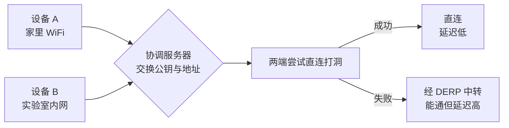
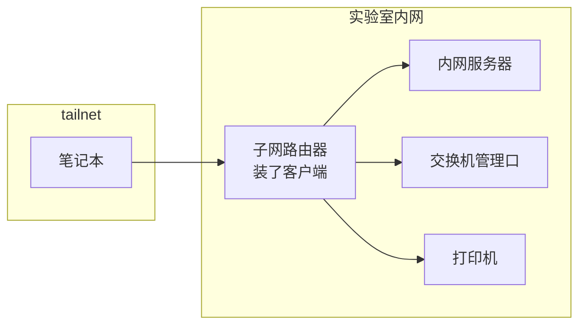
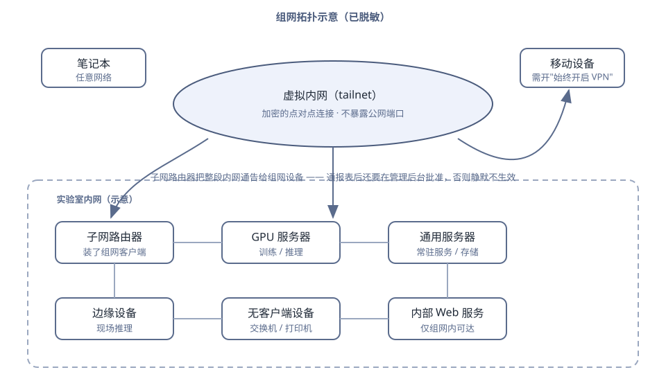

# Tailscale 组网

## 一、技术是什么

Tailscale 是一套**把不同网络环境的设备连成一张虚拟内网**的工具。装上客户端、登录同一个账号，设备之间就能像在同一个局域网里一样互相访问——不管它是在实验室有线网、家里 WiFi、还是手机流量。

它基于 **WireGuard**（一种现代 VPN 协议），但把"点对点打洞、密钥交换、NAT 穿透、身份认证"这些原本要手工配的东西全做成了自动的。你只需要做两件事：**装客户端**、**登录**。

在这套体系里：

- **tailnet**：你的虚拟内网，由登录账号决定，别人默认看不到。
- **节点 / 设备**：加入 tailnet 的每一台机器，各自有一个 `100.x.y.z` 的地址，以及一个你自己定的名字。
- **ACL**：访问控制策略，规定谁能连谁。默认策略是"同一 tailnet 内全通"，正式环境应该收紧。
- **DERP**：中转服务器。打洞成功时设备直连；打洞失败（对称 NAT、严格防火墙）时走 DERP 中转，能通但延迟高。

一句话：**它把"组网"从一件需要网络专业知识的事，变成一件需要会用账号的事。**

---

## 二、为什么使用

实验室的设备天然散落在不同的网络里：

| 场景 | 没有组网时的麻烦 |
| --- | --- |
| 从宿舍连实验室的服务器 | 要么把服务暴露到公网（危险），要么每次去现场 |
| 笔记本 ↔ 台式机传文件 | 靠微信/U 盘/共享盘绕一圈 |
| 手机上看实验进度 | 只能看群里别人转发 |
| 服务器访问实验室另一台机器的服务 | 要么同网段，要么写静态路由 |
| 出外地还要管服务器 | 要么开一堆端口映射，要么 VPN 半天连不上 |

Tailscale 一次解决这些，而且**不需要在路由器上开端口**——这是它对实验室安全最大的价值：**内网服务不需要暴露到公网就能被自己人访问。**

选它的理由（当时比较过的备选）：

- **比手工配 WireGuard 省事**：密钥和 NAT 穿透自动化。
- **比 frp / 端口映射安全**：不开公网端口，不依赖端口扫描不到。
- **比商业远程桌面可控**：能拿到完整网络层，不只是屏幕，用命令行和脚本都行；而且不依赖第三方服务器可见我们的流量（端到端加密）。
- **比自建 Headscale 起步快**：Headscale 是开源的自托管控制面，适合需要完全自主掌控的场景，但要多维护一个服务。**如果将来有"数据不能经过第三方控制面"的硬要求，迁移路径是 Tailscale → Headscale**，客户端不用换。

代价要说清楚：**控制面是第三方的**。设备名单、在线状态这些元数据在 Tailscale 那边可见（通信内容是加密的）。对实验室当前的场景可以接受；将来若政策不允许，再迁 Headscale。

---

## 三、工作原理

### 3.1 连接是怎么建立的



1. 每台设备启动后向**控制面**报到，拿到自己的身份和别人的公钥。
2. 两台设备要通信时，各自尝试从自己的网络里"打洞"出一条直连通道。
3. 打洞成功 → 直接点对点，**流量不经过任何中转**。
4. 打洞失败 → 走 DERP 中转。仍然端到端加密，中转服务器看不到内容，但**延迟会明显升高**。

所以判断"网络好不好"，第一步永远是看**是直连还是中转**。

### 3.2 子网路由（让组网设备访问整个内网）

默认情况下，组网只能访问**装了客户端的那些设备**。但实验室里总有些设备装不了客户端（交换机、打印机、老设备、只认内网的设备）。解决办法是让**一台机器当"路由器"**，把整个内网网段通告出去：



**三件事缺一不可**（这是最容易漏的地方）：

1. **路由器端**：开启系统转发，并同意通告这个网段。
2. **控制面**：在管理后台**批准**这条路由。（通告了但没批准 = 不生效，而且没有任何报错，最难查）
3. **客户端**：接受路由（`--accept-routes`）。

### 3.3 三个概念的关系

| 概念 | 作用 | 典型用途 |
| --- | --- | --- |
| **组网访问** | 让设备之间能互相连 | 从宿舍连服务器、跨机传文件 |
| **子网路由** | 让组网设备访问整个内网网段 | 访问没装客户端的设备 |
| **出口节点** | 让设备的所有流量都从某个节点出去 | 用实验室的网络出口访问受限资源 |

---

## 四、使用环境

**支持**：Windows、macOS、Linux、Android、iOS、WSL、Docker、以及无图形界面的容器环境（userspace 模式）。

**不需要**：公网 IP、路由器端口映射、固定的内网地址。

**需要**：能出网的网络环境；一个账号用于登录（可用 GitHub 等第三方账号登录）；足够的权限安装客户端和（子网路由场景下）调整系统网络配置。

**版本**：本实验室当前使用 `1.102.4`。桌面端建议用官方包管理器安装（Windows 用 winget，取得的是官方签名包），不要下载来路不明的安装包。

**一个要注意的环境限制**：本实验室所用的 tailnet **不支持自动签发 TLS 证书**（`tailscale cert` 会返回 `does not support getting TLS certs`）。因此"把服务通过组网暴露"时只能用 **HTTP 端口**方式，不能直接用 443 的自动 HTTPS。要对外提供 HTTPS 必须另配证书（见[反向代理与 HTTPS](反向代理与HTTPS.md)）。

**移动端的两个必做项**（不做会莫名其妙掉线）：

1. 把客户端加入**电池优化白名单**（不受限制）。
2. 打开**「始终开启 VPN」**。

否则锁屏一段时间后连接断开，表现是"明明开着却连不上"，非常难查。

---

## 五、基本使用

### 5.1 安装与登录

**Windows**（管理员 PowerShell）：

```powershell
winget install --id Tailscale.Tailscale -e --accept-package-agreements --accept-source-agreements
```

装完后 `tailscale.exe` **不在 PATH** 里，用完整路径或自己加入 PATH：

```powershell
& "C:\Program Files\Tailscale\tailscale.exe" up --hostname=<设备名> --accept-routes
```

**Linux 服务器**：

```bash
curl -fsSL https://tailscale.com/install.sh | sh
sudo tailscale up --hostname=<设备名> --ssh --advertise-routes=<内网网段> --accept-routes
```

- `--hostname` 定名字，**起有意义的名字**（按"位置+角色"命名），不要用随机主机名，否则以后自己也认不出哪台是哪台。
- `--ssh` 开启 Tailscale 自带的 SSH（注意：**它和系统 sshd 监听 22 端口不能同时用**，会抢端口）。
- `--advertise-routes` 通告要转发出去的网段（子网路由场景）。
- `--accept-routes` 接受别人通告的路由。

**Arch / WSL**：

```bash
pacman -S --needed tailscale
sudo systemctl enable --now tailscaled
sudo tailscale up --hostname=<设备名> --accept-routes --accept-dns=false
```

WSL 里加 `--accept-dns=false`：WSL 的 DNS 由 Windows 侧接管，让 Tailscale 改写 DNS 常导致解析异常。

**容器 / 无 TUN 设备的环境**（兜底方案）：

```bash
tailscale up --tun=userspace-networking --socks5-server=localhost:1055
```

这种模式下不新建网卡，只能通过 SOCKS5 代理访问，能力受限但能通。

### 5.2 子网路由的完整步骤

**第一步，路由器端开转发并通告**：

```bash
# 临时生效（重启失效，用于验证）
sudo sysctl -w net.ipv4.ip_forward=1
sudo sysctl -w net.ipv6.conf.all.forwarding=1

# 持久化
printf 'net.ipv4.ip_forward=1\nnet.ipv6.conf.all.forwarding=1\n' | sudo tee /etc/sysctl.d/99-tailscale.conf
sudo sysctl -p /etc/sysctl.d/99-tailscale.conf

# 通告网段
sudo tailscale up --advertise-routes=<内网网段> --accept-routes
```

**第二步，管理后台批准路由**：登录 `https://login.tailscale.com/admin/machines`，找到那台机器 → 路由设置 → 批准。

> **这一步漏了就完全不生效，而且没有任何报错。**"配置都对了但连不上"，先回来查这里。

**第三步，客户端接受路由**：`--accept-routes`（Windows 和 Linux 都要，且**必须在服务重启后仍然带着这个参数**）。

### 5.3 日常命令

| 命令 | 用途 |
| --- | --- |
| `tailscale status` | 看所有设备的状态、地址、**是直连还是中转** |
| `tailscale ping <设备名>` | 探连通性与延迟，**会顺带告诉你是直连还是 DERP** |
| `tailscale ip -4` | 看本机的组网地址 |
| `tailscale netcheck` | 检查本机到各 DERP 节点的网络质量 |
| `tailscale up --accept-routes` | 补上"接受路由" |
| `tailscale down` | 临时断开 |
| `tailscale cert <域名>` | 申请证书（**本实验室的 tailnet 不支持，会报 500**） |

### 5.4 把内部 Web 服务暴露给组网设备

不要直接把服务挂到公网，也不要绑 `0.0.0.0` 让整个内网都能进。用组网内置的反向代理，把服务**只暴露给 tailnet**：

```bash
# 把本机 127.0.0.1:<服务端口> 暴露为组网内的 <端口>
tailscale serve --bg --http=8443 http://127.0.0.1:<服务端口>
```

- `--bg` 让它在后台常驻（不加的话关掉终端就没了）。
- **本实验室只能用 `--http=<端口>`**，不能用 `--https=443`（见第四节的环境限制）。
- 服务仍然只监听 `127.0.0.1`，**不暴露到内网**，这样"能访问"的范围被限制在 tailnet 内。

`tailscale serve status` 看当前暴露了什么，`tailscale serve reset` 全清掉。

---

## 六、实际应用

### 6.1 典型拓扑



（图中只画了设备角色，真实设备名、地址与网段在内部库。）

### 6.2 本实验室的实测数字

| 场景 | 延迟 | 说明 |
| --- | --- | --- |
| 台式 ↔ 笔记本（同地点） | 约 4 ms | 直连 |
| 到服务器 | 约 3 ms | 直连 |
| 手机（同网段） | 约 10 ms | 直连 |
| 手机关 WiFi 走流量 | 约 145 ms | **中转**（DERP 东京） |
| 距离最远的可用中转节点 | 约 380 ms | 新加坡 |

**怎么用这组数字**：一旦发现某个操作的延迟从个位数毫秒跳到一百多毫秒，基本可以断定**掉到中转上了**；常见的误判是"网络变慢"。这时候查 `tailscale status` 比查带宽有用。

### 6.3 我们用组网做的事

- 从任何地方登录实验室服务器，**不需要开任何公网端口**。
- 把内部 Web 界面（Agent 控制台、监控面板等）只暴露给组网设备。
- 跨机文件传输、跨机接管长任务会话。
- 让组网设备访问到整个实验室内网网段（子网路由），省掉逐台装客户端。

---

## 七、常见问题

### 连不上 / 掉线

| 现象 | 常见原因 | 怎么查 |
| --- | --- | --- |
| 手机上"开着但连不上" | 被系统杀了后台（电池优化）或没开"始终开启 VPN" | 检查这两项设置 |
| 笔记本换了网络就连不上 | 之前**退出了登录/被停用**，或本地防火墙拦了 | `tailscale status` 看本机状态；查本地防火墙 |
| 一直走中转、延迟高 | 打洞失败（对称 NAT、严格防火墙、运营商限制） | `tailscale ping <设备>` 会说明走的是直连还是中转 |
| **本机**访问某个内部域名 404，别的设备访问正常 | 本机有别的服务占了 80 端口，把请求抢走了 | 见[技术经验：端口占用导致同域名本机访问 404](../技术经验/端口占用导致同域名本机访问404.md) |
| 装了 Radmin VPN / 其它虚拟网卡后连不上 | 多个虚拟网卡**抢占路由** | 退出其它隧道软件再试 |
| 能 ping 通设备，但访问不了其它内网设备 | 子网路由三件套缺一件 | 依次核对：转发开没开、后台批没批、客户端 `--accept-routes` 有没有 |

### 配置都对但服务访问不到

按这个顺序查，**不要跳**：

1. 服务本身在监听吗？（`netstat` / `ss` 看端口，注意监听的是 `127.0.0.1` 还是 `0.0.0.0`）
2. 服务绑在 `127.0.0.1` 时，`tailscale serve` 配了吗？
3. `tailscale serve status` 里有没有这条规则？
4. 防火墙放行了吗？（组网流量走的是虚拟网卡，很多防火墙规则只放行了物理网卡）

### 一个高频误区

**`tailscale cert` 报 500 是本实验室 tailnet 的固定现象**：它不支持签发证书（见第四节）。不要在这上面反复试，直接改用 HTTP 方式暴露，或走[反向代理与 HTTPS](反向代理与HTTPS.md)自己配证书。

---

## 八、延伸方向

| 方向 | 什么时候需要 | 说明 |
| --- | --- | --- |
| **ACL 精细化** | 设备变多、有不该互通的组 | 默认全通不适合长期；按"谁能连谁"收紧，改在管理后台的 ACL |
| **自建 Headscale** | 有"数据不能经过第三方控制面"的硬要求 | 开源控制面实现，客户端不用换；代价是自己维护一个服务 |
| **出口节点** | 需要借用某个地点的网络出口 | 让全部流量从指定节点出去 |
| **Tailscale SSH** | 想省掉 SSH 密钥管理 | 用身份替代密钥；注意**和系统 sshd 抢 22 端口**，只能选一个 |
| **高可用子网路由** | 怕路由器单点故障 | 多台通告同一网段，故障时自动切换 |
| **与备份/监控打通** | 设备变多之后 | 新设备自动纳入巡检与备份范围 |

---

## 相关

- [监控与备份](监控与备份.md) —— 组网设备的健康巡检
- [Agent 平台部署](Agent平台部署.md) —— 用组网把 Agent 平台暴露给成员
- [技术经验：端口占用导致同域名本机访问 404](../技术经验/端口占用导致同域名本机访问404.md) —— 一个非常规、很容易卡住的坑
- [项目实践：设备与 Agent 统一管理](../项目实践/设备与Agent统一管理.md) —— 把组网、会话常驻、统一入口组合起来
