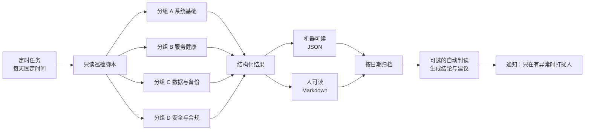

# 监控与备份

## 一、技术是什么

这一块由四件事组成，**顺序不能颠倒**：

| 顺序 | 做什么 | 解决什么 |
| --- | --- | --- |
| 1 | **备份** | 数据没了之后能救回来 |
| 2 | **巡检** | 定期主动看一眼，别等出事 |
| 3 | **监控告警** | 出事的时候立刻知道 |
| 4 | **报告留痕** | 事后能查"什么时候开始不对的" |

**为什么备份排第一**：备份是唯一"没有替代方案"的一环。监控可以后补，巡检可以后补，数据丢了补不回来。

再拆细一点：

- **备份** = 有副本 + 能恢复 + **验证过能恢复**（第三点最常被省略）。
- **巡检** = 定时跑一批**只读**检查，产出结构化结果。
- **监控** = 对关键指标做持续探测，越界即告警。
- **报告留痕** = 每次巡检落一份带时间戳的文件，形成可比对的时间序列。

---

## 二、为什么使用

### 2.1 没有这一层会发生什么

| 缺失 | 现实后果 |
| --- | --- |
| 没有备份 | 一次误删 = 几个月的工作没了。而且往往是**在需要它的那天才发现它一直没在跑** |
| 没有巡检 | 磁盘满了、证书过期了、备份任务失败了，都是"直到有人被卡住"才知道 |
| 没有监控 | 半夜服务挂了，第二天早上才知道，中间几小时的任务全失败 |
| 没有报告 | 出故障时无法回答"上次好的时候是什么状态"，只能靠猜 |

### 2.2 比"有没有监控"更重要的一件事

**巡检必须只读。**一个会自动改动系统的巡检脚本，比没有巡检更危险——它会在你不知情的时候改东西，而且你无法从报告里知道它改了什么。

所以我们把处置动作分成三档，写在脚本里、写在报告里：

| 档 | 含义 | 例子 |
| --- | --- | --- |
| 🟢 **白名单自愈** | 幂等、无副作用、可回滚 | 重启一个已经死掉的探测任务、清理临时文件 |
| 🟡 **必须先问** | 有副作用但影响可控 | 重启一个业务服务、清理缓存目录 |
| 🔴 **永远不做** | 影响面不可控 | 改网络配置、动分区、删数据、变更权限 |

**"永远不做"这一档必须是写死的**，不能是"默认不做但可以开关"。因为开关总有一天会被打开。

---

## 三、工作原理

### 3.1 巡检的骨架



四组的划分原则是**按"谁能修"分组**，不是按技术分类：

| 组 | 检查什么 | 谁来修 |
| --- | --- | --- |
| A 基础 | 磁盘、内存、负载、时间同步、驱动状态 | 服务器负责人 |
| B 服务 | 各常驻服务是否在、端口是否在监听、接口是否返回正常 | 对应服务负责人 |
| C 数据 | 备份任务是否成功、备份文件是否可读、最近一次恢复演练时间 | 数据负责人 |
| D 合规 | 账号是否异常、密钥是否即将过期、暴露面是否变化 | 部门负责人 |

### 3.2 告警的设计原则

**告警必须稀缺，否则会被忽略。**一条总在响的告警等于没有告警。

- 只在**需要人做点什么**的时候发通知。纯粹"一切正常"的报告归档就好，不必打扰人。
- 每条告警要能回答：**现在要做什么？**如果答案是"再看看"，那它不该是告警，应该是报告里的一行。
- 一条告警要能对应到**一个负责人**。没有负责人的告警会在群里飘着。

### 3.3 备份的三条硬规则

1. **3-2-1**：至少 3 份副本、2 种介质、1 份在异地（或至少另一台物理机器）。
2. **备份与源不放在同一块盘上**。同盘备份只能防误删，不能防盘坏。
3. **定期做恢复演练**，并记录演练日期。**没有演练过的备份，等于没有备份**——这是这一节唯一一句不需要解释的话。

---

## 四、使用环境

| 项 | 要求 |
| --- | --- |
| 定时执行 | 系统自带的任务计划（Windows 计划任务 / Linux 的 `systemd` timer 或 `cron`） |
| 脚本语言 | 优先用系统自带的脚本能力，减少依赖；跨平台的巡检建议用 PowerShell 或 Python |
| 报告存储 | 一个**被备份覆盖**的目录；按 `YYYY-MM-DD` 命名 |
| 权限 | 巡检脚本需要读权限（读日志、读配置）；**不要给它写权限**，从权限上保证它是只读的 |
| 告警通道 | 与 [Agent 平台部署](Agent平台部署.md) 的 L3 共用一套通知，不要另起一套 |

**后台运行的一个注意点**：定时任务里启动的脚本如果开了可见窗口，在无人登录的服务器上会失败或弹窗。用系统的"隐藏运行"方式（计划任务里选"不管用户是否登录都运行"，或用一个只负责隐藏窗口的启动器包一层）。

---

## 五、基本使用

### 5.1 巡检的日常节奏

```text
每天 09:00   执行只读巡检，四组全跑，结果落盘
每天 09:15   对结果做一次自动判读，产出结论与建议
             ├─ 有 🔴 项 → 立即通知负责人
             ├─ 只有 🟡 项 → 汇总后一次性通知
             └─ 全 🟢    → 只归档，不打扰人
每周         人工过一遍一周的报告，看趋势（是否在缓慢变坏）
每月         检查一次备份可读性
每季度       做一次恢复演练，记录日期与耗时
```

**"每周人工看趋势"这一步不能省。**单日报告看不出"磁盘每周涨 3%"这种事，而那才是真正会导致事故的东西。

### 5.2 手动跑一次巡检

```powershell
# 手动触发（用于排查或验证改动）
pwsh -File .\maintenance\maintain.ps1

# 看今天的报告
Get-Content .\maintenance\reports\2026-10-09.md

# 看机器可读的那份（便于自己写脚本统计）
Get-Content .\maintenance\reports\2026-10-09.json | ConvertFrom-Json
```

### 5.3 加一项新的检查

```text
① 判断它属于 A/B/C/D 哪一组（按"谁能修"分，不是按技术分）
② 判断它的处置档位：🟢 自愈 / 🟡 先问 / 🔴 不做
③ 写检查逻辑（只读！）
④ 明确"什么算异常"，并写进报告文本 —— 光有数值不算检查
⑤ 在本页的检查清单里登记
⑥ 故意造一次异常，确认它真的能被发现（这一步最常被跳过）
```

第 ⑥ 步是这一节的重点：**一个没被验证过会报警的检查，不能算作检查。**

---

## 六、实际应用

### 6.1 本实验室的落法

- **巡检**：每天 09:00 由计划任务执行，覆盖 A/B/C/D 四组，**全部只读**。
- **判读**：09:15 由一个 Agent 会话读取当天报告，产出结论与建议，只在有异常时通知人。
- **报告**：按日期落成 `.json` + `.md` 两份，放在独立目录里，纳入备份范围。
- **处置**：严格按 🟢/🟡/🔴 三档；🔴 档写在脚本里且不可通过配置打开。

### 6.2 为什么不追求"全自动修复"

我们**特意**只做了一小部分自愈（🟢 档）。原因是：

- 自动修复会**掩盖根因**。"服务挂了就自动重启"听起来很好，但如果它每周挂两次，自动重启会让你永远不去查为什么。
- 自动修复出错的**代价不对称**：修好了没人知道，修坏了一个操作可能让整个服务起不来。
- 巡检的价值在**让人看见**，不在替人动手。

所以判断标准是：**这个动作做错了会不会让情况更糟？**会 → 不做，只报告。

### 6.3 一个真实的教训（备份的反面教材）

我们遇到过"服务看起来在跑、实际已经失效"的情况：进程还在，但功能已经不可用，而且**没有任何自动检查发现它**。这类故障只能靠"定期主动验证一次功能"来发现，光看进程存在是不够的。

由此得出的检查设计原则：**检查"能不能用"，而不是"在不在"。**能用 HTTP 探测一个功能接口，就比看进程列表有价值得多。

---

## 七、常见问题

| 现象 | 原因 | 处理 |
| --- | --- | --- |
| 报告里某一项总是失败，但实际没事 | 检查逻辑写错了（探错端口、路径变了） | **修检查**，不要忽略这一项——被忽略的检查会让人连其它项的红色也不看了 |
| 定时任务没跑 | 任务计划被禁用 / 脚本路径含空格未加引号 / 中文路径编码问题 | 看任务计划的历史记录；路径一律加引号 |
| 报告文件越积越多 | 没有保留策略 | 加保留策略（例如留 90 天），**但先确认报告目录在备份范围内** |
| 备份任务显示成功，恢复时失败 | 备份的是目录结构，没验证可读性 | 加一项"随机抽一个备份文件校验可读性"，并做恢复演练 |
| 告警太多没人看 | 阈值设得太敏感，或把信息当告警发 | 按 3.2 的原则收敛：只发"需要人做点什么"的 |
| 巡检脚本自己挂了没人知道 | 没有人巡检巡检者 | 给巡检任务本身加一个"最近成功时间"检查，超时未跑即告警 |

**最后一行是这一类系统里最容易被忽略的死角**：监控系统自身的失效，是最难发现的一类失效。

---

## 八、延伸方向

| 方向 | 说明 |
| --- | --- |
| **指标时间序列** | 现在只有每日快照；引入时序数据库后可以看出趋势和增长率，提前预警 |
| **集中告警入口** | 目前分散；收敛到一个入口，并做告警分级与值班轮转 |
| **恢复演练自动化** | 把"恢复一次并验证"做成一键任务，降低演练的心理成本 |
| **配置即代码** | 把服务器配置纳入版本管理，让"某台机器和别的机器不一样"变得可见 |
| **备份的异地副本** | 从"另一台机器"升级到真正异地 |
| **把巡检结果接入知识库** | 故障处理完之后自动生成一条[技术经验](../技术经验/README.md)草稿，人只需补充 |

---

## 相关

- [Agent 平台部署](Agent平台部署.md) —— 被巡检的服务之一
- [Tailscale 组网](Tailscale组网.md) —— 巡检需要能访问到各设备
- [技术经验](../技术经验/README.md) —— 巡检发现的故障，处理完在这里成文
- [待补事实](../待补事实.md) —— 巡检覆盖范围里还有哪些设备没纳入
