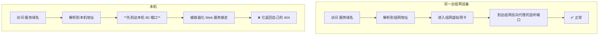

# 端口占用导致同域名本机访问 404

## 一、现象

一个已经通过组网暴露的内部 Web 服务，出现了**本机访问不到、但别的设备访问正常**的怪现象：

| 从哪访问 | 用什么地址 | 结果 |
| --- | --- | --- |
| **本机**浏览器 | `http://<服务域名>` | **404** |
| **本机**浏览器 | `http://127.0.0.1:<服务端口>` | ✅ 正常 |
| **另一台组网设备** | `http://<服务域名>` | ✅ 正常 |

### 这个现象为什么让人困惑

- **服务本身是好的**（`127.0.0.1` 能访问）。
- **域名解析是对的**（别的设备用同一个域名能访问）。
- **只有当"本机"和"域名"两个条件同时满足时才出错。**

三个条件里，最容易让人怀疑的是"服务"和"域名解析"。但两个都被排除了，于是会陷入"看起来哪里都没问题"的状态。

**换个角度想**：为什么"本机"这个条件会改变结果？本机和别的设备到底差在哪？

答案是：**本机访问一个域名时，流量走的是它自己的网络栈和本机的端口。**而本机上**有别的服务占着那个端口**。

---

## 二、环境

| 项 | 情况 |
| --- | --- |
| 操作系统 | Windows 主机 |
| 服务暴露方式 | 组网工具的反向代理，把本机 `127.0.0.1:<服务端口>` 暴露为组网内的一个 HTTP 端口 |
| 本机**另有**一个服务 | 一个容器化的 Web 服务，使用**主机网络模式**，占用了 **80 端口** |
| 域名解析 | 服务域名在组网内解析到**这台机器的组网地址** |

关键在第 3 行：**本机的 80 端口已经被别的东西占了。**

---

## 三、原因

### 3.1 两条路径不一样

同一个域名，本机访问和外部设备访问，走的其实是两条不同的路：



**外部设备**：流量经过组网虚拟网卡，直接投递到组网反向代理监听的端口上，**绕过了本机的 80 端口**。

**本机**：请求先进入本机网络栈，落到 **80 端口**——而 80 端口上坐着另一个服务，它不认识这个域名，于是返回自己的 404。

### 3.2 为什么返回的是 404 而不是"拒绝连接"

因为有服务在 80 端口上**正常接受连接**了，只是它不认识这个请求，所以返回 404。

如果 80 端口上没有服务，会得到"连接被拒绝"，那反而**好查得多**——问题会立刻聚焦到"本机 80 端口"。

**这里最反直觉的一点**：一个完全无关的服务，用"正常工作的方式"（接受连接 + 返回 404）制造了一个看起来像是目标服务出问题的现象。

### 3.3 三层归因

```text
本机访问 404
  → 为什么？请求被本机 80 端口上的另一个服务接走了
    → 为什么会被接走？本机的域名解析指向本机，而本机 80 端口被占用
      → 为什么会允许 80 端口被占用？因为端口分配没有被当作一条红线来管理  ← 根因
```

只写到前两层，解决方案是"本机用 127.0.0.1 访问就好"——这是**绕开**，不是解决。写到第三层，解决方案才是"划定保留端口，禁止任何新服务占用"。

---

## 四、解决方案

### 4.1 已采用的做法

1. **本机自测一律用 `127.0.0.1` + 明确端口**，不要用域名。本机是最特殊的环境，用它测出来的结论常常不能代表真实情况。
2. **把 80 端口列为实验室的保留端口**，写进文档，作为红线：**任何新服务都不得再绑定 80 端口**；需要 Web 入口的服务统一走[反向代理与 HTTPS](../技术模块/反向代理与HTTPS.md)的方案，绑到明确分配的端口上。
3. **建立端口登记**：每个常驻服务用什么端口，登记在内部库的端口表里。**"这个端口归谁"必须能一句话答出来。**
4. **给这条经验写一份文档**（就是本篇），因为它属于"症状出现在完全无关的地方"这一类问题，不写下来一定会再踩。

### 4.2 没有采用的方案

| 方案 | 为什么不采用 |
| --- | --- |
| 把 80 端口上的容器改成别的端口 | 那是实验室统一的 Web 入口，改动影响面大，需要单独规划而不是顺手改 |
| 让本机的域名解析指向别处 | 会让"本机"变成一个长期的例外，下次换设备又要重配 |
| 在本机 hosts 里给该域名写一条特殊解析 | 治标，且引入一个没人记得住的隐藏配置 |
| 什么都不做，只告诉使用者"本机用 127.0.0.1" | 可以缓解，但下一个人遇到同样现象仍会花掉同样长的时间去查 |

**选第 1 条的理由**：它把问题从"每次都要解释"变成"制度上不会再发生"。

### 4.3 一个重要的推广

**"80 端口保留"这条规则真正要防的不是 80 端口本身。**

要防的是**"服务之间通过占用同一个端口产生隐式耦合"**：某个服务的症状，可能是另一个服务造成的，而两者在代码、配置、负责人上毫无关系。

**所以正确的做法不是记住"80 端口不能用"，而是记住"每个端口都要有明确归属"。**

---

## 五、验证

```text
① netstat 查 80 端口归谁：
     netstat -ano | findstr :80
   → 应能明确指到一个进程与其所属服务
② 本机用 127.0.0.1:<服务端口> 访问 → 正常
③ 从另一台组网设备用 <服务域名> 访问 → 正常
④ 本机用 <服务域名> 访问 → 仍然是 404（这是**预期**的，因为 80 端口仍被占用）
⑤ 确认端口登记表里，80 端口被标注为"保留，不得新增占用"
```

**第 ④ 步的结果是"仍然 404"——这是对的。**修好之后本机用域名访问依然不通，因为真正的修复是"不再让新的占用发生"和"用正确的方式自测"，不是让本机的域名访问变通。

如果验证时发现"改完之后本机用域名也能访问了"，那说明 80 端口上的服务被停掉了——**这不是我们做的改动，要查是谁停的**。

---

## 六、经验

### 可迁移的判断规则

1. **同一个 URL 在本机和外部表现不一致时，第一件事是查本机的端口占用，而不是查服务本身。**（`netstat -ano | findstr :<端口>`）
2. **"连接被拒绝"和"返回 404"是两个完全不同的问题。**
   - 连接被拒绝 → 没有服务在监听。
   - 返回 404 → **有服务在监听，只是不是你要的那个。**
3. **端口是共享资源，必须登记归属。**不然会出现"某个服务挂了，其实是另一个服务引起的"这种极难排查的耦合。
4. **本机永远是最特殊的环境。**凡是"只有本机出问题"的现象，先假设本机有什么特殊之处（端口占用、特殊解析、残留配置），而不是假设服务有条件地失败。
5. **排错时不要只问"哪里错了"，要问"这两个场景差在哪"。**本例的答案是"差在本机 80 端口有别的服务"——这个问题比"为什么 404"有效得多。

### 这个坑最反直觉的地方

**制造这个故障的服务，自己工作得完全正常。**

它接受了连接、返回了正确的 404（对它自己来说）。它没有报错、没有异常、日志干净。**从它的视角看，一切正常。**

所以"去查那个看起来在报错的服务"这个直觉在这里完全失效。**要查的是那个没报错的服务。**

---

## 相关

- [技术模块：Tailscale 组网](../技术模块/Tailscale组网.md) —— 组网暴露服务的方式
- [技术模块：反向代理与 HTTPS](../技术模块/反向代理与HTTPS.md) —— 怎样让多个服务共用一个入口而不互相干扰
- [职责与服务目录](../职责与服务目录.md) —— 端口申请的流程
- [技术经验：双启动器竞争导致服务卡死](双启动器竞争导致服务卡死.md) —— 同样属于"两个东西争同一个资源"
