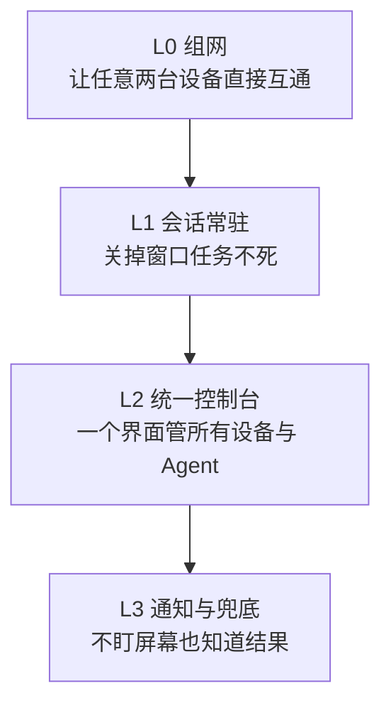

# 设备与 Agent 统一管理

## 一、项目概述

实验室的机器和 Agent 是**慢慢长出来的**：先有一台台式机，然后加了笔记本和手机，然后服务器上跑起了几个自托管服务，然后每台机器上又各装了一两个 Agent。

每一件单独看都不难，合起来的问题是这个：

```text
机器 A 上有 Agent 甲，机器 B 上有 Agent 乙，机器 C 上的服务只有从机器 C 才连得上。
人在机器 A 上，想知道乙在跑什么；想重启 C 上的服务；想收一个"任务完成了"的通知。
```

**这个项目要解决的是一件事：让"我人在哪"和"我要操作哪台机器"解耦。**

具体做法是四层各挑一个组件拼起来：**组网**（机器之间互相可达）+ **会话常驻**（关掉窗口任务不死）+ **统一控制台**（一个界面看所有设备与 Agent）+ **通知**（不盯着屏幕也能知道结果）。

> **当前状态**：L0 组网已落地并在用；L1/L2 已选型并有部分实践；L3 通知只做到"能用"。本文档第八节的复现步骤按"分阶段最小可验证"组织，**不是一次装完的完整脚本**。

## 二、项目目标

| 层次 | 目标 | 验收方式 |
| --- | --- | --- |
| 基础 | 任意两台自己的设备之间可直接互通，不依赖第三方中转 | 两台设备互 ping 延迟在个位毫秒级 |
| 基础 | 没有客户端的设备（打印机一类）也能被访问 | 从另一台设备能访问到它的管理页面 |
| 会话 | 关掉终端窗口后，里面跑的任务继续跑；换台设备能重新接管 | 断开后重连，任务仍在且能继续看输出 |
| 统一 | 一个界面能看到所有设备与上面的 Agent，不用逐台 SSH | 打开控制台能看到设备列表与状态 |
| 通知 | 任务结束时能收到通知；通知渠道只有一个，不散 | 关掉手机上的所有相关 App，只留一个渠道，仍能收到 |
| 可交接 | 设备与 Agent 的清单是一份可读的文件，新人照着能理解全貌 | 新人读完清单能说出每台机器上有什么 |

**不做的事**：不做跨实验室的联邦组网；不做把内网服务暴露到公网。

## 三、技术路线

### 3.1 四层结构



四层的顺序**不能换**：没有 L0 就没有"任意两台设备互通"，上面的每一层都要自己造一套连接方式；没有 L1，L2 里的会话一断就没了。

### 3.2 每层选什么，为什么

| 层 | 选择 | 理由 | 放弃的方案与原因 |
| --- | --- | --- | --- |
| L0 组网 | **Tailscale** | 几乎零配置就能打洞直连，控制面免费；设备种类多（Windows / Linux / 手机）都有客户端 | 自建 Headscale：控制面自主但要多维护一套服务，现阶段收益不明显，**保留为后续可平滑迁移的方向**；纯手工 WireGuard：节点一多，配置就是手工活 |
| L1 会话常驻 | **herdr** | 跨平台、能 `--remote` 接管别的机器上的会话；比传统终端复用器少一层心智负担 | 传统终端复用器：能用，但跨机接管体验差 |
| L2 统一控制台 | **Agents Anywhere（自托管）** | 开源、可自己部署、覆盖面比"只管一种 Agent"的方案广 | 只管某一种 Agent 的工具：**不覆盖我们实际在用的全部 Agent**；SaaS 控制台：把设备信息交出去 |
| L3 通知 | **单一 IM 机器人 + 一个自建推送服务** | 推送服务自建不受第三方限制；IM 机器人只留一个，避免"通知散落在三个地方" | 多个机器人并行：结果是没人知道该看哪个 |

### 3.3 一条贯穿全程的原则

**连接一律由内向外发起。**

设备上的连接器**主动连出去**到控制台，控制台不需要能连上设备。这样：

- 不需要在内网开任何入站端口。
- 设备在 NAT 后面、换网络、换 IP 都不影响。
- 想停掉某台设备的接入，在控制台上断开即可。

这条原则是选型时最有分量的一条：**它把"暴露"这件事从架构里删掉了，不需要靠配置去限制。**

## 四、开发环境

| 项 | 说明 |
| --- | --- |
| 清单文件 | 一份 YAML（本项目里叫 `fleet.yaml`），记录所有设备、上面的 Agent、暴露的服务与约定 |
| 会话管理器 | herdr |
| 控制台 | Agents Anywhere，自托管 |
| 运行环境 | 每个被管理的设备，系统各异（Windows / Linux / 移动端） |
| 脚本 | PowerShell（Windows 侧）与 Shell（Linux 侧） |
| 版本控制 | 清单文件进版本控制；**凭据不进** |

> 具体版本与安装路径见各设备的技术模块页面；真实清单属内部信息。

## 五、硬件环境

本项目不绑定具体硬件，按**角色**描述（真实型号与数量在内部库）：

| 角色 | 特征 | 承担的作用 |
| --- | --- | --- |
| 常驻台式机 | 一直在线的 Windows 主机 | 日常操作面、控制台、部分 Agent |
| 移动笔记本 | 会换网络、会关机 | 随身接入；需要"到哪都能连回来" |
| GPU 服务器 | Linux，有显卡 | 跑重任务 |
| 通用服务器 | Linux，长期在线 | 跑自托管服务 |
| 移动设备 | 手机 / 平板 | 手机端客户端；偶尔也作为被管理对象 |
| 无客户端设备 | 打印机一类装不了客户端的设备 | **需要靠子网路由才能被访问**（见 §八） |
| 边缘设备 | 算力有限的小设备 | 跑轻量 Agent 与采集 |

**图**：[组网拓扑示意](../assets/网络拓扑示意.svg)（已脱敏，只画角色不画真实设备）

> ⚠️ 无客户端设备这一类是很多方案的盲区：能装客户端的设备都好办，装不了的那些必须靠"把整个网段通告出去"来解决。

## 六、核心代码

本项目的"代码"主要是一份**清单文件**和几个围绕它的脚本。

### 6.1 清单文件的结构

```yaml
version: 1
session_manager: herdr
tailnet: <组网标识>

network:
  provider: tailscale
  server_subnet_router:
    advertise_routes: [<内网网段>]     # 由哪台机器通告
  rules: [...]

devices:
  <设备名>:
    display_name: <显示名>
    os: <系统>
    location: <位置，泛化为「实验室/机房」>
    addresses: { lan: <内网IP>, tailscale: <组网IP> }
    agents:
      - id: <Agent 标识>
        kind: <类型>
        launch: <启动命令>
        session: agent-<设备名>-<用途>
    runtime: { docker: <有/无>, node: <有/无> }
    known_issues: [...]

exposed_web_uis:
  - device: <设备名>
    name: <服务名>
    url: <组网内地址>
    auth: <认证方式>

invariants:      # 不变量：违反这些的改动一律不合并
  - Agent 必须跑在 herdr 会话里
  - 面向组网的服务只绑组网地址，不绑 0.0.0.0
  - IM 机器人只保留一个
  - 每台设备独立 SSH 密钥
  - 设备或 Agent 有变动，先改本文件
```

### 6.2 `invariants`（不变量）为什么放在清单里

因为**规范写在另一个文档里，就不会被遵守**。把"不变量"放进被频繁修改的那份文件，改设备的时候就一定会看到它。

### 6.3 命名规范

- 会话：`agent-<设备名>-<用途>`，例如 `agent-<设备>-部署`。
- Agent 标识：`<角色>-<编号>`。
- 设备名：统一的命名前缀 + 角色，**不用人名**（人会更替，设备还在）。

> 命名规范的价值不在整齐，而在**当你在控制台看到一堆会话时，能立刻知道哪个是干什么的**。

## 七、项目实现

按层推进，每层都要能独立验证之后再往上走：

| 阶段 | 做什么 | 完成标志 |
| --- | --- | --- |
| ① | 选一台机器接入组网，再接入第二台 | 两台互 ping 通，延迟是直连水平 |
| ② | 把所有设备接入组网 | 设备列表里能看到全部设备 |
| ③ | 配子网路由，覆盖装不了客户端的设备 | 从另一台设备能访问到那台无客户端设备 |
| ④ | 装会话管理器，把 Agent 的启动方式统一到会话里 | 关掉窗口，任务还在 |
| ⑤ | 部署自托管控制台，接入各设备 | 控制台里能看到设备与 Agent |
| ⑥ | 配通知渠道，只留一个 | 任务结束时收到一条通知 |
| ⑦ | 把这份清单写完整，纳入版本控制 | 新人读完能说出全貌 |

**顺序上最容易做错的是 ⑥**：先接了三个通知渠道，然后没有任何人看。

## 八、复现步骤

> **本节的写法说明**：这个项目不是"装一个软件"，没法写成一条条命令从头跑到尾。所以按**阶段最小可验证**组织——每个阶段都能独立跑通并判定成功，再进下一阶段。命令中的主机名、地址、网段一律用占位符，**真实值在内部库**。

### 8.1 准备什么

| 需要 | 说明 |
| --- | --- |
| 至少两台设备 | 一台始终在线，一台可移动。**只有一台设备验证不了任何东西** |
| 每台设备的管理员权限 | 装客户端、改路由都要 |
| 一个组网账号 | 免费额度足够个人规模使用 |
| 一个可用的内网网段信息 | 只有要覆盖无客户端设备时才需要 |
| 统一的设备命名 | **先定好名字再接入**，改名比接入麻烦 |
| 前置知识 | 知道 IP / 端口 / 子网是什么意思；不会就先看[学习课程](../学习课程/README.md) |

**会卡住的地方**：设备命名没定好就开始接入；只有一台设备就想验证"任意两台互通"。

### 8.2 装什么

**每台设备装组网客户端**（不要求全部一致，按系统选）：

```powershell
# Windows（winget 官方包）
winget install --id Tailscale.Tailscale -e --accept-package-agreements --accept-source-agreements
```

```bash
# Linux（发行版官方脚本）
curl -fsSL https://tailscale.com/install.sh | sh
```

```bash
# Arch / WSL
sudo pacman -S --needed tailscale
```

> Windows 上客户端**不在 PATH 里**，要么用全路径调用，要么自己加进 PATH。这是第一次用最容易迷惑的一点。

**再装会话管理器**（每台要跑 Agent 的机器）：

```bash
herdr          # 启动/接入本机后台会话
herdr --remote <主机>     # 跨机接管
```

**最后装自托管控制台**：按项目官方文档部署（Docker 自托管），**不要**用公共的托管服务。

### 8.3 配什么

1. **设备命名**：接入时就用最终名字，不要用默认主机名。
2. **子网路由**（仅当有无客户端设备时）——需要**三件事同时成立，缺一件就静默不生效**：

   | 在哪做 | 做什么 |
   | --- | --- |
   | 路由器所在的服务器 | 打开 IP 转发 |
   | 组网控制面 | 批准这条路由通告 |
   | 每台要访问该网段的客户端 | 启动时加 `--accept-routes` |

   ```bash
   # 服务器端：开转发并持久化
   printf 'net.ipv4.ip_forward=1\nnet.ipv6.conf.all.forwarding=1\n' | sudo tee /etc/sysctl.d/99-tailscale.conf
   sudo sysctl -p /etc/sysctl.d/99-tailscale.conf
   ```

   > **只通告不批准，或者客户端没加 `--accept-routes`，都不会报错**，只是不通。这一条在[Tailscale 组网](../技术模块/Tailscale组网.md)里有更完整的说明。

3. **服务只绑组网地址**：面向组网的服务监听在组网地址上，**不要监听 `0.0.0.0`**。
4. **端口登记**：任何新增的服务端口先在端口登记表里登记（内部库）。**端口冲突的症状会出现在完全无关的服务上**，见[端口占用导致同域名本机访问 404](../技术经验/端口占用导致同域名本机访问404.md)。
5. **通知只留一个渠道**。
6. **给每个 Agent 定会话名**，并写进清单文件。

### 8.4 跑什么

```bash
# ① 接入组网（每台设备各做一次）
#    Windows
& "C:\Program Files\Tailscale\tailscale.exe" up --hostname=<设备名> --accept-routes
#    Linux 服务器（同时作为子网路由器）
sudo tailscale up --hostname=<设备名> --ssh --advertise-routes=<内网网段> --accept-routes
#    WSL
tailscale up --hostname=<设备名> --accept-routes --accept-dns=false

# ② 看谁在线
tailscale status

# ③ 起一个常驻会话并在里面跑 Agent
herdr
#    然后在会话里启动 Agent；约定会话名 agent-<设备名>-<用途>
```

### 8.5 预期结果

| 动作 | 预期看到 |
| --- | --- |
| `tailscale status` | 所有已接入设备在列表里，每台标注直连还是中转 |
| `tailscale ping <设备名>` | 通，且延迟是**个位毫秒**（同一局域网内） |
| 关掉终端窗口再重新接入会话 | 会话还在，任务仍在跑，能看到它期间的新输出 |
| 从另一台设备访问无客户端设备 | 能打开它的管理页面 |
| 控制台页面 | 设备列表与各设备上的 Agent 都在 |

**一个特别好用的判据**：如果延迟从个位数**跳到一百毫秒以上**，说明这条链路掉到中转了——不是网络坏了，是打洞没成功。这时先看是不是有别的 VPN 客户端抢了路由。

### 8.6 如何判定成功

按阶段验收，**不要看"装完了没"，看这几条**：

```text
① 两台设备互 ping，延迟是个位毫秒          → L0 打成
② 断网重连（关 WiFi 再开），设备自动回来    → L0 稳定
③ 从一台设备访问到无客户端设备的管理页       → 子网路由三件套齐了
④ 关掉所有终端窗口，第二天回来看任务还在     → L1 打成
⑤ 在控制台里看到全部设备，不用逐台 SSH      → L2 打成
⑥ 手机关掉除一个渠道外的所有相关 App，
   仍能收到任务结束通知                     → L3 打成
⑦ 把清单文件给一个没参与的人读，
   他能说出每台机器上有什么                  → 可交接
```

**第 ⑦ 条是这个项目真正的完成标准。**前面六条只说明"能跑"，第七条说明"别人能接手"。

## 九、项目成果

| 成果 | 状态 |
| --- | --- |
| 组网（L0） | ✅ 已落地并在用，含子网路由（覆盖无客户端设备） |
| 会话常驻（L1） | 🟡 已有实践与命名约定，未在所有设备上统一 |
| 统一控制台（L2） | 🟡 已选型，未全面接入 |
| 通知（L3） | 🟡 渠道已定，覆盖面不全 |
| 设备与 Agent 清单 | ✅ 结构已定，内容随设备变动更新 |
| 本文档 | 🟡 骨架已成，§四/§五/§六 的具体值待补 |

## 十、已知问题

| 问题 | 表现 | 现状 |
| --- | --- | --- |
| GPU 驱动/库版本不一致 | `nvidia-smi: Driver/library version mismatch (NVML <版本>)`，GPU 相关任务随机失败 | ⬜ **未修复**，需要重启机器对齐，重启前要确认没有别人在跑 GPU 任务。详见[GPU 与 CUDA 环境](../技术模块/GPU与CUDA环境.md) §7.1 |
| 连接器"记录被占用" | 报 `The local Connector record is busy`，重试无效 | ✅ 已定位：**不要反复重试**。见[Agent 平台部署](../技术模块/Agent平台部署.md) §七 |
| Linux 上的连接器迁移锁 | 同一路径重试永远 busy | ✅ 已定位：旧版记录目录名与新版差一个连字符，锁由绝对路径哈希决定；绕法是在新版期望位置**预写"迁移已完成"标记** |
| 非 loopback 暴露的服务 | 报 `Invalid Host header` | ✅ 已定位：先认证、并声明公开地址 |
| 通知渠道曾经太多 | 消息散在三个 App 里，没人知道该看哪个 | ✅ 已收敛为一个渠道 |
| 子网路由漏做某一步 | 静默不通，无报错 | ✅ 已写入 §8.3 的三件套清单 |

## 十一、后续方向

1. **把 `invariants` 变成可检查的**：现在它是"写在清单里的约定"，下一步让巡检脚本真的去查（例如"有没有服务绑在 `0.0.0.0`"）。
2. **清单驱动的批量操作**：有了结构化清单，就可以从它生成 SSH 配置、巡检目标、控制台接入项，避免三处各配一遍。
3. **组网控制面的自主化**：迁移到自建控制面，保留随时切回的能力（选型时没有放弃这条路）。
4. **把 GPU 排班变成基础设施**：现在"谁在用卡"靠问，应该有一个占用视图。
5. **新人上手自动化**：把 §八 的阶段 ① 写成一条脚本，新人一条命令接进来。

## 相关

- [技术模块：Tailscale 组网](../技术模块/Tailscale组网.md) —— L0 的完整用法
- [技术模块：Agent 平台部署](../技术模块/Agent平台部署.md) —— L1 与 L2 的完整用法
- [技术模块：监控与备份](../技术模块/监控与备份.md) —— 设备接入之后怎么知道它还好
- [技术经验：端口占用导致同域名本机访问 404](../技术经验/端口占用导致同域名本机访问404.md) —— 端口登记的由来
